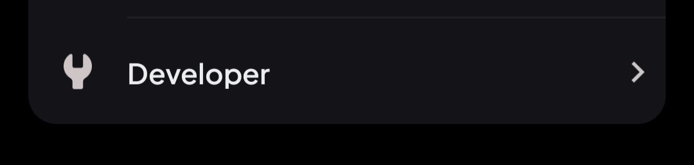

# NeoCord installation

We support two methods as of right now:
* Android - XPosed hook
* Any - Use custom endpoint

# Install using XPosed hook
1. Download the hooker [here](https://github.com/true1ann/neocord-xposed/releases/latest)
2. Use XPosed manager of your choice to enable it for Discord
3. Force close Discord and open it

# Install using custom endpoint
> **IMPORTANT**: You should treat all occurances of 'NeoCord', as it was your mod is the same. It doesnt matter if you use Vendetta, Bunny, Revenge, or something else.
1. Open your Discord
2. Go to Settings
3. 
4. 
5. Go back
6. 
7. 
> Link: https://github.com/true1ann/neocord-bundle/releases/latest/download/neocord.min.js
8. Force close Discord and open it
